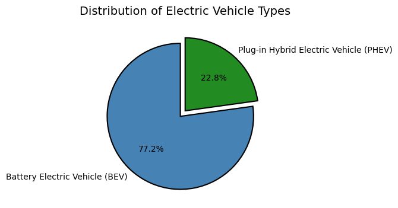
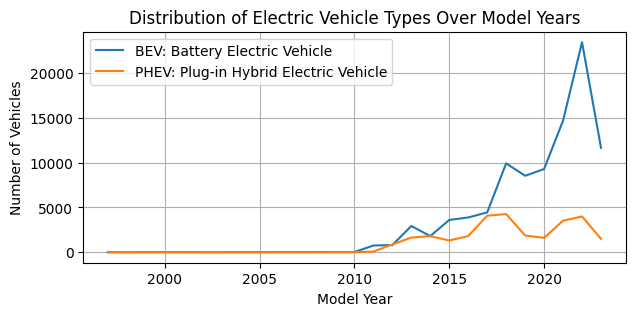
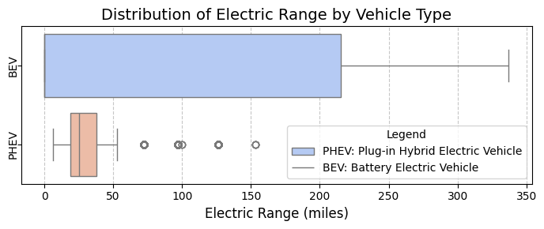
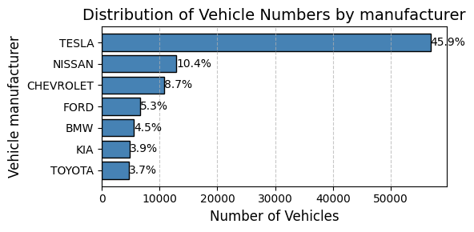
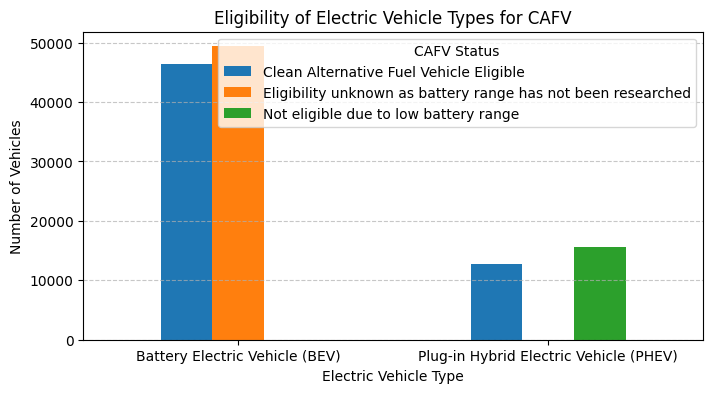

# OVERVIEW 
Welcome to my first project in data analysis, where I am interested in the electric car market in the city of Washington in the United States. Nowadays, the number of policies encouraging the replacement of old polluting energy sources by new ones is growing. Being myself a 5th and final year student in Energy and Industrial Processes engineering, my interest in this project seems obvious.

The data sourced from a Kaggle dataset which provides a foundation for my analysis, containing detailed information on the type of electric cars throught the Washinton State, their eligibility to the CAFV, or the evolution of the use of these cars during the years. Here is the link [Kaggle_dataset.ipynb](https://www.kaggle.com/datasets/utkarshx27/electric-vehicle-population-data/versions/1/data)

Through a series of Python scripts, I explore the following questions.

# THE QUESTIONS

Below are the questions I want to answer in my project:

1. What is the proportion of Battery Electric Vehicles (BEVs) and Plug-in Hybrid Electric Vehicles (PHEVs) that are currently registered through Washington State Department ?
2. How many electric vehicles are manufactured for each type of vehicle over the years ?
3. Which type of vehicles have the most electric range?
4. Which manufacturers produce the most electric vehicles ?
5. What is the propensity of vehicles to meet the eligibility criteria for Clean Alternative Fuel Vehicle incentives or benefits, for each type of vehicle ?


# TOOLS I USED 
For my deep dive into the data analyst job market, I harnessed the power of several key tools:

- Python: The backbone of my analysis, allowing me to analyze the data and find critical insights.I also used the following Python libraries:
  - Pandas Library: This was used to analyze the data.
  - Matplotlib Library: I visualized the data.
  - Seaborn Library: Helped me create more advanced visuals.
  - Missingno Library : To have a visual view of the nan values distribution.
- Jupyter Notebooks inside of Google Collab: The tool I used to run my Python scripts which let me easily include my notes and analysis.
- Git & GitHub: Essential for version control and sharing my Python code and analysis, ensuring collaboration and project tracking.

# DATA PREPERATION AND CLEANUP
This section outlines the steps taken to prepare the data for analysis, ensuring accuracy and usability.

## Import & Clean Up Data
I start by importing necessary libraries and loading the dataset, followed by initial data cleaning tasks to ensure data quality.

```python
# Importing librairies
import pandas as pd
import matplotlib.pyplot as plt
import seaborn as sns
import missingno as msno
# Path to the file in Google Drive
file_path = '/content/drive/My Drive/Colab Notebooks/Electric_Vehicle_Population_Data.csv'
# Load the data
dataset = pd.read_csv(file_path)
# Show first lines to preview
dataset.head(2)
# Clean up some columns
dataset['Electric Vehicle Type'] = dataset['Electric Vehicle Type'].astype(str)
dataset['State'] = dataset['State'].astype(str)
# keep a copy of the original dataset for good practice
dataset_original = dataset.copy()
# Dropping nan values after seeing their insignificant impact in our analysis
dataset = dataset.dropna()
```

View my notebook with all the analysis here: 
[Jupyter_notebook_entire.ipynb](./Jupyter_notebook_entire.ipynb)

# The Analysis 

## 1. What is the proportion of Battery Electric Vehicles (BEVs) and Plug-in Hybrid Electric Vehicles (PHEVs) that are currently registered through Washington State Department ?

This will give us an idea of ​​what types of electric cars are most commonly used.

### Results 


*A pie chart to show the proportion of BEVs and PHEVs through WA.*

### Insights

This pie chart shows that Battery Electric Vehicles (BEVs) strongly dominate the electric vehicle market with 77.2% of the share, while Plug-in Hybrid Electric Vehicles (PHEVs) account for the remaining 22.8%. This distribution clearly indicates that fully electric vehicles are significantly more prevalent than hybrid alternatives.

## 2. How many electric vehicles are manufactured for each type of vehicle over the years ?

### Results 


*The evolution of the the number of BEVs and PHEVs through WA State from 1997 to 2023.*

### Insights

This graph shows the distribution of electric vehicle types (BEVs and PHEVs) over model years from approximately 2000 to 2022. Here are the key insights:

• Overall Growth Trend: There's a clear upward trend in both vehicle types, particularly accelerating after 2010, indicating the growing adoption of electric vehicles.

• BEV Dominance: Battery Electric Vehicles (shown in blue) have experienced significantly stronger growth compared to Plug-in Hybrid Electric Vehicles (shown in orange), especially in recent years.

• Major BEV Spike: There's a dramatic spike in BEV numbers around 2020-2021, reaching approximately 22,000 vehicles, followed by a sharp decline. This could be due to various factors such as:
   - Increased manufacturer investment in electric vehicles
   - Government incentives or regulations
   - Growing consumer interest in fully electric vehicles
     
• PHEV Stability: Plug-in Hybrid Electric Vehicles show more modest but steady growth, maintaining numbers between 2,000-5,000 vehicles in recent years, suggesting a stable but smaller market segment.

• Early Market: Both vehicle types show minimal presence before 2010, indicating that the electric vehicle market was relatively nascent in the early 2000s.

## 3. Which type of vehicles have the most electric range?

  The electric range refers to the maximum distance an electric vehicle (EV) or plug-in hybrid (PHEV) can travel on its battery's charge without using a gasoline engine (if applicable). This metric is crucial because it influences the vehicle's usability for different driving scenarios, such as daily commutes or long trips, and affects consumer confidence in EVs. A longer electric range reduces the need for frequent recharging, enhances convenience, and lowers reliance on fossil fuels, contributing to cost savings and environmental benefits.

### Results


*A box plot showing the car type with the highest electric ranges.*

### Insights

* Battery Electric Vehicles (BEVs) show a significantly higher electric range, typically between 200-350 miles, demonstrating their superior capacity for longer-distance travel.
* Plug-in Hybrid Electric Vehicles (PHEVs) have a much more limited electric range, generally clustering around 0-50 miles, reflecting their dual power source design.
* There are several PHEV outliers (shown as individual dots) with ranges between 100-150 miles, suggesting some advanced PHEV models are pushing the boundaries of electric-only operation.
* The wide gap in electric range capabilities between BEVs and PHEVs (approximately 150 miles) highlights the fundamental technological difference between these two vehicle categories.

So, for potential buyers, the choice between BEVs and PHEVs should primarily depend on driving habits. If you regularly drive long distances and have access to charging infrastructure, BEVs' superior range makes them the ideal choice. However, if you mainly do short commutes and want the security of a backup fuel source, PHEVs offer a practical transition to electric mobility despite their limited electric-only range.

## 4. Which manufacturers produce the most electric vehicles ?

### Results


*An horizontal barchart showing the companies producing the most electric vehicles.*

### Insights

* Tesla clearly dominates the market with 45.9% of total vehicles, which is more than four times higher than the next competitor, Nissan (10.4%).
* The remaining manufacturers (Chevrolet, Ford, etc...) each hold less than 9% market share, collectively representing less than half of Tesla's presence in the market.

In conclusion, Tesla's commanding 45.9% market share in the electric vehicle sector demonstrates their unrivaled leadership position, significantly outperforming competitors like Nissan at 10.4% and other major manufacturers who each capture less than 9% of the market. This market dominance aligns perfectly with Tesla's mission to accelerate the transition to sustainable energy. As a pioneering force in electric vehicles, Tesla has not only established itself as the industry leader but is also delivering on its environmental commitments, helping customers prevent over 20 million metric tons of CO2e emissions in 2023 alone. Their success in both market share and environmental impact validates their strategic vision and positions them as a key driver in the global shift toward sustainable transportation.

## 5. What is the propensity of vehicles to meet the eligibility criteria for Clean Alternative Fuel Vehicle incentives or benefits, for each type of vehicle ?

What is the CAFV? Well, this stands for Clean Alternative Fuel Vehicle. A Clean Alternative Fuel Vehicle (CAFV) refers to a vehicle designed to use alternative fuels or technologies that produce fewer emissions compared to traditional gasoline or diesel-powered vehicles. These vehicles are intended to reduce environmental impact and reliance on fossil fuels. So, this clearly depends on the electrical range.

### Visualise data 


*Vertical barchart showing the eligibility of each type of vehicule for CAFV.*

### Insights

* Battery Electric Vehicles (BEVs) dominate the market with 45,000 vehicles, but we still need to research battery range data for more than half of them to confirm their CAFV eligibility.
* Among Plug-in Hybrids (PHEVs), which total about 27,000 vehicles, most are actually not qualifying for CAFV status due to limited battery range - this could be a key area for improvement in future models.
* The data reveals a clear opportunity: working with manufacturers to ensure new EV models meet CAFV battery range requirements could significantly increase the number of eligible vehicles in our market.
* For immediate action, we should prioritize completing the battery range research for the large number of BEVs with unknown status, as this could substantially increase our confirmed CAFV-eligible vehicle count.


# WHAT I LEARNED 

Through this analysis of electric vehicles in Washington state, I've witnessed how theoretical concepts from my energy engineering studies translate into real-world market dynamics. The clear dominance of one manufacturer demonstrates how technological advantages directly influence market leadership, while the competition between established automotive companies reveals diverse strategies in approaching the green transition. The performance gap between BEVs and PHEVs, particularly in range capabilities and CAFV eligibility, highlights both the rapid advancement of battery technology and the challenges in creating transitional solutions.

This project has reinforced a crucial lesson for my future as an energy engineer: the transition to green energy extends beyond pure technical specifications. Success in this field requires understanding how technological capabilities translate into market adoption, regulatory compliance, and most importantly, practical solutions that can effectively replace traditional technologies while meeting consumer needs.
